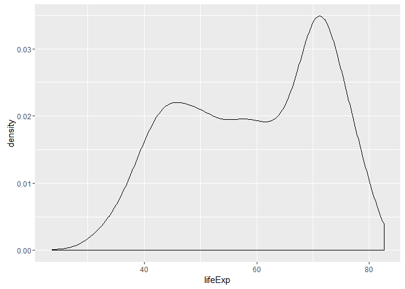
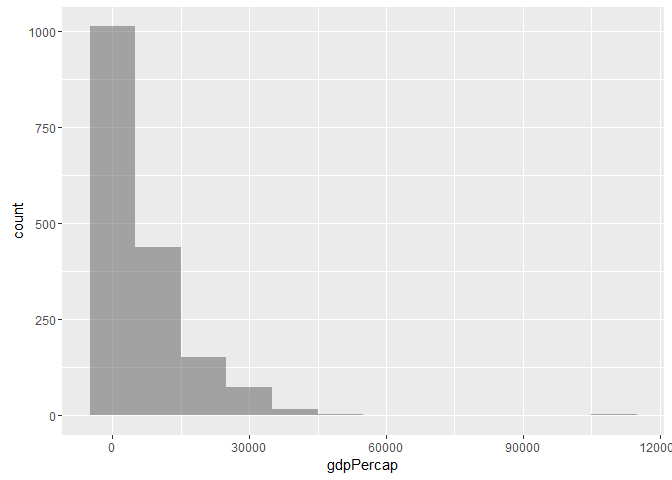

Gapminder Unwinder: Hwk\_2
================
*d8a-m8* a.k.a. *delta thru data* a.k.a Yevgen '*the d8a nonh8a*' Kovalenko
2016-09-27

Minder the Gap. The door's are now closing.
-------------------------------------------

Welcome! This should be a fun ride today for you and I. So in this following report we will be exploring the Gapminder dataset...however, I will have no idea what you will end up seeing.

So, get some coffee or tea or any consumable, potable liquid %&gt;% temperature(hot:cold) and let's get started. :D

Why?

``` r
library("random")
```

That's why. I will be using the *random* package to make this interesting. Let's explore the relationship between life expectancy as a function of GDP per capita. (*You will need internet connection to run some of this code. Especially pertaining to the **random** functions.*)

Initially, let us see what we are working with before any *<sub>CrA</sub>* *Z* *~<sub>~</sub> neSS ~<sub>~</sub>*.

``` r
str(gapminder)  
```

    ## Classes 'tbl_df', 'tbl' and 'data.frame':    1704 obs. of  6 variables:
    ##  $ country  : Factor w/ 142 levels "Afghanistan",..: 1 1 1 1 1 1 1 1 1 1 ...
    ##  $ continent: Factor w/ 5 levels "Africa","Americas",..: 3 3 3 3 3 3 3 3 3 3 ...
    ##  $ year     : int  1952 1957 1962 1967 1972 1977 1982 1987 1992 1997 ...
    ##  $ lifeExp  : num  28.8 30.3 32 34 36.1 ...
    ##  $ pop      : int  8425333 9240934 10267083 11537966 13079460 14880372 12881816 13867957 16317921 22227415 ...
    ##  $ gdpPercap: num  779 821 853 836 740 ...

``` r
#Exploring tbl.df of gapminder, also could have formatted the script as in Chuck 4 (Summary)
```

As expected this dataset is a tbl = tibble dataframe. Buckets of observations (1704) of the six tracked variables: country(factor), continent(factor), year(integer), life expectancy(double/float), population(integer), GDP per capita(double/float). We can also see there were 152 surveyed countries on all **five** continents.

*<sub>looking</sub> <sub>at</sub> <sub>you</sub> **<sub>ANTarctica</sub>***

To be clear, Gapminder is a tibble dataframe with 1704 rows of observations catergorized by six columns of factors/variables. These variables and the corresponding flavours are listed above.

Apart from using str(), simply typing the object name would provide that data following "\#A tibble: ...".

Using the summary function, we can look at the basic statistical data of this dataframe. In particular, let us only consider the year, life expectancy, population, and GDP.

``` r
gapminder[,3:6] %>% 
  summary()
```

    ##       year         lifeExp           pop              gdpPercap       
    ##  Min.   :1952   Min.   :23.60   Min.   :6.001e+04   Min.   :   241.2  
    ##  1st Qu.:1966   1st Qu.:48.20   1st Qu.:2.794e+06   1st Qu.:  1202.1  
    ##  Median :1980   Median :60.71   Median :7.024e+06   Median :  3531.8  
    ##  Mean   :1980   Mean   :59.47   Mean   :2.960e+07   Mean   :  7215.3  
    ##  3rd Qu.:1993   3rd Qu.:70.85   3rd Qu.:1.959e+07   3rd Qu.:  9325.5  
    ##  Max.   :2007   Max.   :82.60   Max.   :1.319e+09   Max.   :113523.1

Here we can see the global maximums and minimums of all four quantitative data, in addition to the first and third quartiles, the median, and the mean. Let's only consider life expectancy and GDP for now with respect to countries and continents.

Here are some histograms (the facetted plots will be density plots, since density &gt; histogram) of these two variables without respect to continent or country.

``` r
p_hist <- gapminder %>% 
  ggplot()

p_hist + geom_histogram(aes(x = lifeExp), alpha = 0.5, binwidth = 5)
```



``` r
p_hist + geom_histogram(aes(x = gdpPercap),alpha = 0.5, binwidth = 10000)
```



With respect to continents? <sub>(</sub> <sub>countries</sub> <sub>would</sub> <sub>be</sub> <sub>crazy</sub> <sub>)</sub>

``` r
p_hist + facet_wrap(~ continent) + geom_density(aes(x = lifeExp), alpha = 0.5) 
```


``` r
p_hist + facet_wrap(~ continent) + geom_density(aes(x = gdpPercap), alpha = 0.5)
```


So, what do we see here? Well, for life expectancy Americas, Asia, Europe, and Oceania have left-skewed distributions. Africa has a right-skewed distribution. As for GDP, all continents are right-skewed for GDP per capita.

Can we say anything about the relationship between these two variables? *No.* In order to talk about this we must plot **MORE GRAPHS** !!!

Investigation of Socio-Ecomonics in Gapminder
---------------------------------------------

Now let's look at the exact same parameters as before and dive into how GDP and life expectancy correlate. *<sub>(</sub> <sub>Now</sub> <sub>with</sub> <sub>ggplots</sub> <sub>and</sub> <sub>dplyr</sub> <sub>)</sub>*

``` r
pt_lvg <- gapminder %>% 
  ggplot()

#Making plot space

pt_lvg + geom_point(aes(x = gdpPercap, y = lifeExp, colour = continent)) + geom_smooth(aes(x = gdpPercap, y = lifeExp))
```


``` r
#Assigning points
```

Let's plot this on a different scale.

``` r
pt_lvg + geom_point(aes(x = log10(gdpPercap), y = log10(lifeExp), colour = continent)) + geom_smooth(aes(x = log10(gdpPercap), y = log10(lifeExp)))
```


``` r
#or I could have added "+ scale_x_log10()" instead of two log10() :/
```

Really interesting. There does appear to be some linear correlation, particularly in the middle of the plot, but the correlation breaks down at the fringes. Possibly due to unknown, unconsidered factors.

Let's check the correlation between these two variables.

~~ Pearson's Correlation Coefficient & Coefficient of Determination~~

``` r
r_p <- with(gapminder, cor(log10(gdpPercap), log10(lifeExp))) #Assigning object that is the P.C.C. of lifeExp and GDP

r_p #Pearson's C.C. (P.C.C.)
```

    ## [1] 0.7830724

``` r
r_p^2 #Coefficent of determination
```

    ## [1] 0.6132023

As seen above, there is some correlation between life expectancy and GDP per capita. Perhaps this is trivial because as GDP per capita increases, it could be said that quality of life also increases and thus, perhaps life expectancy. Although this clearly does not paint the complete picture (R = 0.783, (R<sup>2</sup>) = 0.613) as the other factors will affect both that may or may not affect the other.

Back to business.

The above trends may reflect the socio-economic status of a continent as life expectancy can be seen to correlate with GDP. Let's take a look to see if this trend holds up for different places. Let us make an arbitrary decision on which countries to investigate. *INCOMING: random data retreiver*

``` r
country_names <- unique(gapminder['country'])

rand.lett <- randomStrings(n=1,len=1,digits=F)
print(rand.lett)
```

    ##      V1 
    ## [1,] "M"

``` r
cnm <- grep(
  as.list(rand.lett), 
  as.matrix(country_names[,1]))

name.list <- country_names[cnm,]

print(name.list)
```

    ## # A tibble: 12 × 1
    ##       country
    ##        <fctr>
    ## 1  Madagascar
    ## 2      Malawi
    ## 3    Malaysia
    ## 4        Mali
    ## 5  Mauritania
    ## 6   Mauritius
    ## 7      Mexico
    ## 8    Mongolia
    ## 9  Montenegro
    ## 10    Morocco
    ## 11 Mozambique
    ## 12    Myanmar

``` r
# @ this point, all I have done is made of list of all the unique names of countries in gapminder. I proceed to grab all countries within that list that start with a randomly selected letter. A tibble of said countries is made "name.list". Then the script prints the list.

new_gp <- gapminder %>% 
  filter(country %in% c(as.matrix(name.list)))

new_gp_data <- new_gp %>% 
  select(lifeExp, gdpPercap)
  
print(new_gp)
```

    ## # A tibble: 144 × 6
    ##       country continent  year lifeExp      pop gdpPercap
    ##        <fctr>    <fctr> <int>   <dbl>    <int>     <dbl>
    ## 1  Madagascar    Africa  1952  36.681  4762912 1443.0117
    ## 2  Madagascar    Africa  1957  38.865  5181679 1589.2027
    ## 3  Madagascar    Africa  1962  40.848  5703324 1643.3871
    ## 4  Madagascar    Africa  1967  42.881  6334556 1634.0473
    ## 5  Madagascar    Africa  1972  44.851  7082430 1748.5630
    ## 6  Madagascar    Africa  1977  46.881  8007166 1544.2286
    ## 7  Madagascar    Africa  1982  48.969  9171477 1302.8787
    ## 8  Madagascar    Africa  1987  49.350 10568642 1155.4419
    ## 9  Madagascar    Africa  1992  52.214 12210395 1040.6762
    ## 10 Madagascar    Africa  1997  54.978 14165114  986.2959
    ## # ... with 134 more rows

``` r
print(new_gp_data)
```

    ## # A tibble: 144 × 2
    ##    lifeExp gdpPercap
    ##      <dbl>     <dbl>
    ## 1   36.681 1443.0117
    ## 2   38.865 1589.2027
    ## 3   40.848 1643.3871
    ## 4   42.881 1634.0473
    ## 5   44.851 1748.5630
    ## 6   46.881 1544.2286
    ## 7   48.969 1302.8787
    ## 8   49.350 1155.4419
    ## 9   52.214 1040.6762
    ## 10  54.978  986.2959
    ## # ... with 134 more rows

``` r
# Here is the good part well, the important one. A new gapminder "new_gp" data set is filtered by all the names in the name.list. New_gp_data is created by selecting for GDP and life expectancy to ease calculations.
```

Now if you're still here. We have one more thing to do. I hope it's not too crazy.

``` r
p_ngp <- new_gp %>% 
  ggplot()

p_ngp + geom_point(aes(x = gdpPercap, y = lifeExp)) + geom_smooth(aes(x = gdpPercap, y = lifeExp)) + scale_x_log10() + facet_wrap(~ country)
```


``` r
r.p <- new_gp_data %>% 
  with(cor(log10(gdpPercap), log10(lifeExp))) 

#Assigning object that is the P.C.C. of lifeExp and GDP

r.p #Pearson's C.C. (P.C.C.)
```

    ## [1] 0.8079753

``` r
r.p^2 #Coefficent of determination
```

    ## [1] 0.652824

Now if this works as intended, you will have a "unique" letter from print(rand.lett) and list of countries with associated graphs and correlation coffiecients.

If you can handle reading these nearly 200 lines of code, I applaud you. I got tired just typing this all out!

To show that you truly got to this point, please include your print(rand.lett) and correlation coffiecient results in your review of my work.

*CHEERS!*
