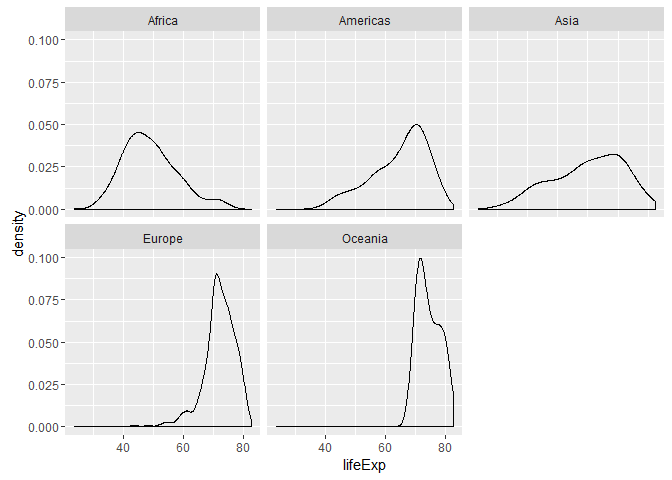
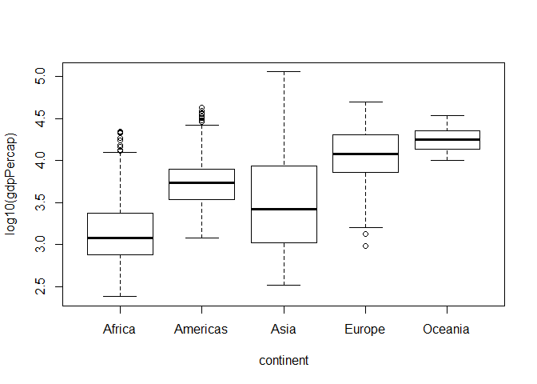

Gapminder Unwinder: Hwk\_2
================
*d8a-m8* a.k.a. *delta thru data* a.k.a Yevgen '*the d8a nonh8a*' Kovalenko
2016-09-26

Minder the Gap. The door's are now closing.
-------------------------------------------

Welcome! This should be a fun ride today for you and I. So in this following report we will be exploring the Gapminder dataset...however, I will have no idea what you will end up seeing.

So, get some coffee or tea or any consumable, potable liquid %&gt;% temperature(hot:cold) and let's get started. :D

Why?

``` r
library("random")
```

That's why. I will be using the *random* package to make this interesting. Let's explore the relationship between life expectancy as a function of GDP per capita. (*You will need internet connection to run some of this code. Especially pertaining to the **random** functions.*)

Initially, let us see what we are working with before any *<sub>CrA</sub>* *Z* *~<sub>~</sub> neSS ~<sub>~</sub>*.

``` r
str(gapminder)  #Exploring tbl.df of gapminder
```

    ## Classes 'tbl_df', 'tbl' and 'data.frame':    1704 obs. of  6 variables:
    ##  $ country  : Factor w/ 142 levels "Afghanistan",..: 1 1 1 1 1 1 1 1 1 1 ...
    ##  $ continent: Factor w/ 5 levels "Africa","Americas",..: 3 3 3 3 3 3 3 3 3 3 ...
    ##  $ year     : int  1952 1957 1962 1967 1972 1977 1982 1987 1992 1997 ...
    ##  $ lifeExp  : num  28.8 30.3 32 34 36.1 ...
    ##  $ pop      : int  8425333 9240934 10267083 11537966 13079460 14880372 12881816 13867957 16317921 22227415 ...
    ##  $ gdpPercap: num  779 821 853 836 740 ...

As expected this dataset is a tbl = tibble dataframe. Buckets of observations of the six tracked variables: country, continent, year, life expectancy, population, GDP per capita. We can also see there were 152 surveyed countries on all **five** continents. *<sub>looking</sub> <sub>at</sub> <sub>you</sub> **<sub>ANTarctica</sub>***

Investigation of Socio-Ecomonics in Gapminder
---------------------------------------------

Now let's look at the exact same parameters as before and dive into how GDP and life expectancy correlate. *<sub>(</sub> <sub>Now</sub> <sub>with</sub> <sub>ggplots</sub> <sub>and</sub> <sub>dplyr</sub> <sub>)</sub>*

``` r
p_lvg <- gapminder %>% 
  ggplot(aes(x = log10(gdpPercap), y = log10(lifeExp))) #Making plot space

p_lvg + geom_point() + geom_smooth(lwd = 1, se = F, method = "lm")  #Assigning points and a trendline
```


~~ Pearson's Correlation Coefficient & Coefficient of Determination~~

``` r
r_p <- with(gapminder, cor(log10(gdpPercap), log10(lifeExp))) #Assigning object that is the P.C.C. of lifeExp and GDP

print(r_p) #Pearson's C.C. (P.C.C.)
```

    ## [1] 0.7830724

``` r
r_p^2 #Coefficent of determination
```

    ## [1] 0.6132023

As seen above, there is some correlation between life expectancy and GDP per capita. Perhaps this is trivial because as GDP per capita increases, it could be said that quality of life also increases and thus, perhaps life expectancy. Although this clearly does not paint the complete picture (R = 0.783, (R<sup>2</sup>) = 0.613) as the other factors will affect both that may or may not affect the other.

Perhaps, later I will input a model here onced I figure out how to avoid the "singlar gradient" error. The help online is too maths for me, right now.

Back to business.

``` r
plot(lifeExp ~ continent, data = gapminder)
```



``` r
plot(log10(gdpPercap) ~ continent, data = gapminder)
```



The above trends may reflect the socio-economic status of a continent as life expectancy can be seen to correlate with GDP. Let's take a look to see if this trend holds up for different places. Let us make an arbitrary decision on which countries to investigate. *INCOMING: random data retreiver*

``` r
country_names <- unique(gapminder['country'])

cnm <- grep(
  as.list(randomStrings(n=1,len=1,digits=F)), 
  as.matrix(country_names[,1]))

name.list <- country_names[cnm,]

print(name.list)
```

    ## # A tibble: 33 × 1
    ##                   country
    ##                    <fctr>
    ## 1              Bangladesh
    ## 2  Bosnia and Herzegovina
    ## 3                 Burundi
    ## 4                Cambodia
    ## 5                  Canada
    ## 6                    Chad
    ## 7           Cote d'Ivoire
    ## 8                 Ecuador
    ## 9             El Salvador
    ## 10                Finland
    ## # ... with 23 more rows

``` r
new_gp <- gapminder %>% 
  filter(country %in% c(as.matrix(name.list)))

new_gp_data <- new_gp %>% 
  select(lifeExp, gdpPercap)
  
print(new_gp)
```

    ## # A tibble: 396 × 6
    ##       country continent  year lifeExp       pop gdpPercap
    ##        <fctr>    <fctr> <int>   <dbl>     <int>     <dbl>
    ## 1  Bangladesh      Asia  1952  37.484  46886859  684.2442
    ## 2  Bangladesh      Asia  1957  39.348  51365468  661.6375
    ## 3  Bangladesh      Asia  1962  41.216  56839289  686.3416
    ## 4  Bangladesh      Asia  1967  43.453  62821884  721.1861
    ## 5  Bangladesh      Asia  1972  45.252  70759295  630.2336
    ## 6  Bangladesh      Asia  1977  46.923  80428306  659.8772
    ## 7  Bangladesh      Asia  1982  50.009  93074406  676.9819
    ## 8  Bangladesh      Asia  1987  52.819 103764241  751.9794
    ## 9  Bangladesh      Asia  1992  56.018 113704579  837.8102
    ## 10 Bangladesh      Asia  1997  59.412 123315288  972.7700
    ## # ... with 386 more rows
